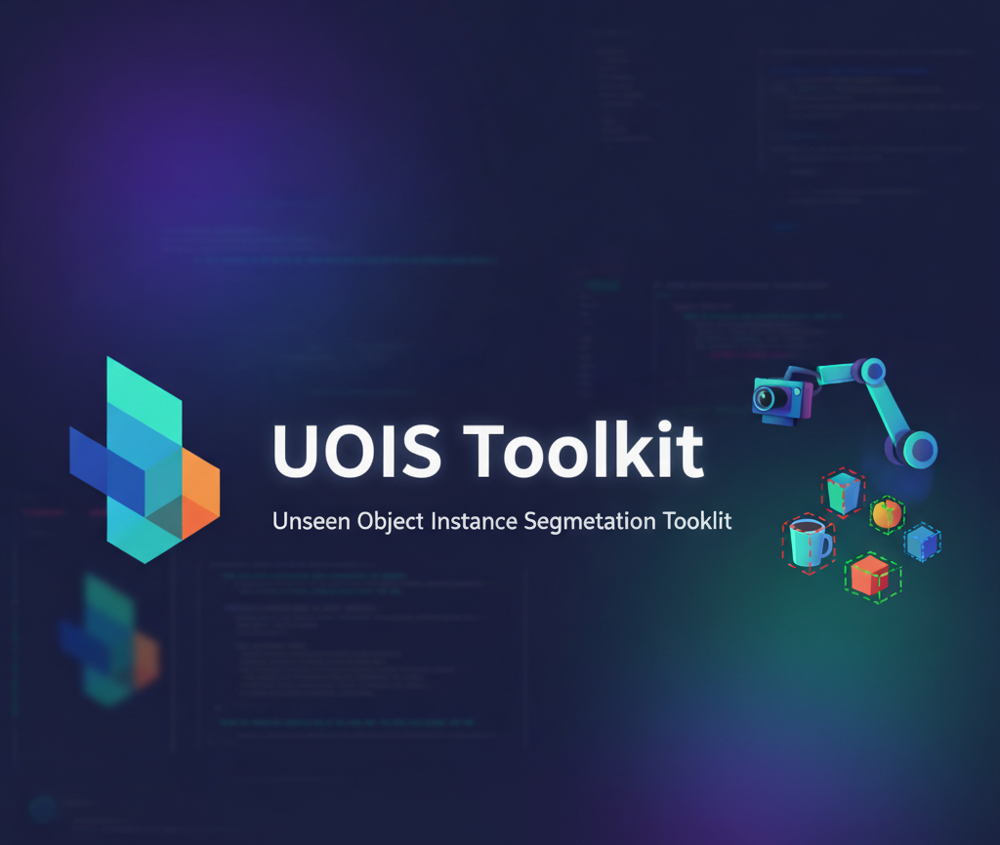

#  **uois_toolkit**  

A toolkit for **Unseen Object Instance Segmentation (UOIS)**  


[](https://github.com/jishnujayakumar/uois_toolkit/actions/workflows/sanity_check.yml)
[](https://pypi.org/project/uois-toolkit/)
[](https://pepy.tech/projects/uois-toolkit)
[](https://www.python.org/downloads/)
[](https://pytorch.org/)
[](https://opensource.org/licenses/MIT)
[](https://github.com/jishnujayakumar/uois_toolkit/stargazers)
[](https://github.com/jishnujayakumar/uois_toolkit/issues)

A PyTorch-based toolkit for loading and processing datasets for **Unseen Object Instance Segmentation (UOIS)**. This repository provides a standardized, easy-to-use interface for several popular UOIS datasets, simplifying the process of training and evaluating segmentation models.

---

## Table of Contents

- [Installation](#installation)
- [Supported Datasets](#supported-datasets)
- [Usage Example](#usage-example)
- [Testing](#testing)
- [For Maintainers](#for-maintainers)
- [License](#license)

---

## Installation

### Prerequisites
- Python 3.9+
- An environment manager like `conda` is recommended.

### Steps

1.  **Clone the repository:**
    ```bash
    git clone https://github.com/jishnujayakumar/uois_toolkit.git
    cd uois_toolkit
    ```

2.  **Install the package:**
    Installing in editable mode (`-e`) allows you to modify the source code without reinstalling. The command will automatically handle all necessary dependencies listed in `pyproject.toml`.
    ```bash
    pip install -e .
    ```

**Note about detectron2**

This project depends on `detectron2` for some dataset utilities and mask handling. `detectron2` includes C++ extensions and must be built for your platform — it cannot always be installed as a pure Python wheel. Please follow the official installation instructions in the Detectron2 meta-repository and install a version compatible with your PyTorch and CUDA (or CPU-only) environment before running the tests or using the datasets:

- Detectron2 installation guide and wheels: https://github.com/facebookresearch/detectron2

On many systems you can install a compatible CPU-only wheel using the prebuilt index, or build from source if needed. If you are running on CI, ensure the runner has the necessary build tools and compatible PyTorch version.

---

## Supported Datasets

This toolkit provides dataloaders for the following datasets:

- Tabletop Object Discovery (TOD)
- OCID
- OSD
- Robot Pushing
- iTeach-HumanPlay

### Download Links

- **Main Datasets (TOD, OCID, OSD, Robot Pushing)**:
  - [**Download from Box**](https://utdallas.box.com/v/uois-datasets)
  - [**Robot Pushing**](https://utdallas.app.box.com/s/yipcemru6qsbw0wj1nsdxq1dw5mjbtiq)
- **iTeach-HumanPlay Dataset**:
  - **D5**: [Download](https://utdallas.box.com/v/iTeach-HumanPlay-D5)
  - **D40**: [Download](https://utdallas.box.com/v/iTeach-HumanPlay-D40)
  - **Test**: [Download](https://utdallas.box.com/v/iTeach-HumanPlay-Test)

### Directory Setup

It is recommended to organize the downloaded datasets into a single `DATA/` directory for convenience, though you can specify the path to each dataset individually.

---

## Usage Example

You can easily import the datamodule into your own projects. The example below demonstrates how to load the `tabletop` dataset using `pytorch-lightning`.

```python
from uois_toolkit import get_datamodule, cfg
import pytorch_lightning as pl

# 1. Define the dataset name and its location
dataset_name = "tabletop"
data_path = "/path/to/your/data/tabletop"

# 2. Get the datamodule instance
# The default configuration can be customized by modifying the `cfg` object
data_module = get_datamodule(
    dataset_name=dataset_name,
    data_path=data_path,
    batch_size=4,
    num_workers=2,
    config=cfg
)

# 3. The datamodule is ready to be used with a PyTorch Lightning Trainer
# model = YourLightningModel()
# trainer = pl.Trainer(accelerator="auto")
# trainer.fit(model, datamodule=data_module)

# Alternatively, you can inspect a data batch directly
data_module.setup()
train_loader = data_module.train_dataloader()
batch = next(iter(train_loader))

print(f"Successfully loaded a batch from the {dataset_name} dataset!")
print("Image tensor shape:", batch["image_color"].shape)
```

---

## Testing

### Local Validation

The repository includes a `pytest` suite to verify that the dataloaders and processing pipelines are working correctly.

To run the tests, you must provide the root paths to your downloaded datasets using the `--dataset_path` argument.

```bash
python -m pytest test/test_datamodule.py -v \
  --dataset_path tabletop=/path/to/your/data/tabletop \
  --dataset_path ocid=/path/to/your/data/ocid \
  --dataset_path osd=/path/to/your/data/osd
  # Add other dataset paths as needed
```
**Note**: You only need to provide paths for the datasets you wish to test.

### Continuous Integration

This repository uses **GitHub Actions** to perform automated sanity checks on every push and pull request to the `main` branch. This workflow ensures that:
1. The package installs correctly.
2. The code adheres to basic linting standards.
3. All core modules remain importable.

This automated process helps maintain code quality and prevents the introduction of breaking changes.

---

## For Maintainers

<details>
<summary>Click to expand for PyPI publishing instructions</summary>

```bash
# 1. Install build tools
python -m pip install build twine

# 2. Clean previous builds
rm -rf build/ dist/ *.egg-info

# 3. Build the distribution files
python -m build

# 4. Upload to PyPI (requires a configured PyPI token)
twine upload dist/*
```

</details>

---

## Citation

If you use this toolkit in your research, please cite:

```bibtex
@software{uois_toolkit,
  author = {Jishnu Jaykumar P and Aggarwal, Avaya and Maheshwari, Animesh},
  title = {uois_toolkit: A PyTorch Toolkit for Unseen Object Instance Segmentation},
  year = {2025},
  url = {https://github.com/jishnujayakumar/uois_toolkit}
}
```

### Dataset Citations

If you use any of the supported datasets, please also cite the original works:

<details>
<summary><b>Tabletop Object Dataset (TOD)</b></summary>

```bibtex
@inproceedings{xiang2020learning,
  title={Learning RGB-D Feature Embeddings for Unseen Object Instance Segmentation},
  author={Xiang, Yu and Xie, Christopher and Mousavian, Arsalan and Fox, Dieter},
  booktitle={Conference on Robot Learning (CoRL)},
  year={2020}
}
```
</details>

<details>
<summary><b>OCID (Object Clutter Indoor Dataset)</b></summary>

```bibtex
@inproceedings{suchi2019easylabel,
  title={EasyLabel: A Semi-Automatic Pixel-wise Object Annotation Tool for Creating Robotic RGB-D Datasets},
  author={Suchi, Markus and Patten, Timothy and Fischinger, David and Vincze, Markus},
  booktitle={International Conference on Robotics and Automation (ICRA)},
  year={2019}
}
```
</details>

<details>
<summary><b>OSD (Object Segmentation Dataset)</b></summary>

```bibtex
@inproceedings{richtsfeld2012segmentation,
  title={Segmentation of Unknown Objects in Indoor Environments},
  author={Richtsfeld, Andreas and Morwald, Thomas and Prankl, Johann and Zillich, Michael and Vincze, Markus},
  booktitle={IEEE/RSJ International Conference on Intelligent Robots and Systems (IROS)},
  year={2012}
}
```
</details>

<details>
<summary><b>Robot Pushing Dataset</b></summary>

```bibtex
@inproceedings{lu2023sss,
  title={Self-Supervised Unseen Object Instance Segmentation via Long-Term Robot Interaction},
  author={Lu, Yangxiao and Khargonkar, Ninad and Xu, Zesheng and Averill, Charles and Palanisamy, Kamalesh and Hang, Kaiyu and Guo, Yunhui and Ruozzi, Nicholas and Xiang, Yu},
  booktitle={Robotics: Science and Systems (RSS)},
  year={2023}
}
```
</details>

<details>
<summary><b>iTeach-HumanPlay Dataset</b></summary>

```bibtex
@misc{p2026iteach,
  title={iTeach: In the Wild Interactive Teaching for Failure-Driven Adaptation of Robot Perception},
  author={Jishnu Jaykumar P and Cole Salvato and Vinaya Bomnale and Jikai Wang and Yu Xiang},
  year={2026},
  eprint={2410.09072},
  archivePrefix={arXiv},
  primaryClass={cs.RO},
  url={https://arxiv.org/abs/2410.09072}
}
```
</details>

## Contributing

Contributions are welcome! Please open an issue or submit a pull request. See [issues](https://github.com/jishnujayakumar/uois_toolkit/issues) for open tasks.

## License

This project is licensed under the MIT License. See the [LICENSE](LICENSE) file for more details.
